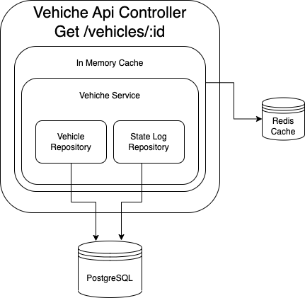
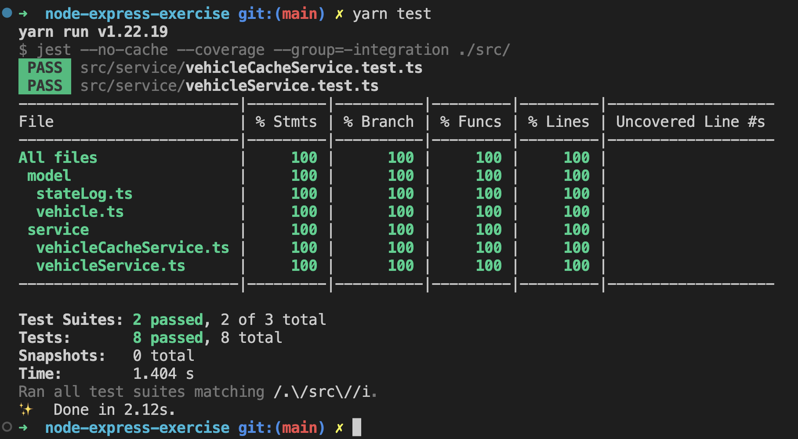
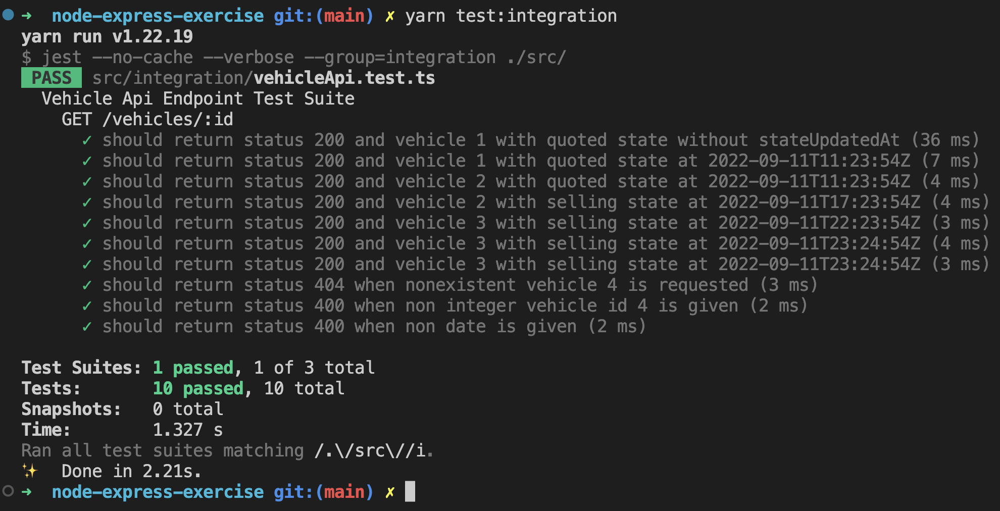

# Node-Express-Exercise

## Install requirements:
 - docker (https://docs.docker.com/get-docker/)

## How to understand the code
This api server is built with Node Js, express and typescript, it's documneted with OpenApi spec, there is an url that visualizes it at below section.

The in-memory cache layer share the same interface of vehiche service (*IVehicleService*), it is like a exetension, if we don't need the in-memory cache anymore we can just remove it from the composition root and inject vehichle service directly to the controller.

## How to run

To initialize this project, run `docker compose up` from the root of this project. This will build and seed the database. By default the database runs on port `5432` and is also exposed on `5432`, if you want to change this you can update `docker-compose.yml`.

### Run dev server locally
1. run `docker compose up` which kicks off the redis and postgresql database with data
2. run `yarn dev` which starts the api locally on `http://localhost:8080/`
3. Open a browser and go to `http://localhost:8080/api-docs/`, it shows the swagger ui and provides a playground to the api 

### Run Unit test
`yarn test`

### Run Integration test
1. run `docker compose up` and `yarn dev`
2. run `yarn test:integration`

## Non Functional Requirment
> Imagine this API endpoint is in a production environment and can be hit multiple times a second. It’s acceptable that clients can get a response stale by 1 minute.

A redis cache is fronted to serve the same request within 1 minute before passing to postgreSql, in production env mutiple instances of api server can communicate with the external redis cluster. 

> Please prepare your project as you would for a production environment, considering reliability (this app would run in multiple instances), and testing. 

In Production env, cluster of api server is preferred by using of cloud service such as AWS ECS/EKS in at least two availability zones, that can prevent data center outage, if regional outage also needs to be considered, a thorough disaster recovery plan is necessary. 